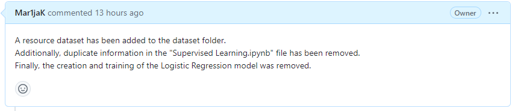

# Отток клиентов

Из «Бета-Банка» стали уходить клиенты. Каждый месяц. Немного, но заметно. Банковские маркетологи посчитали: сохранять текущих клиентов дешевле, чем привлекать новых.

Необходимо спрогнозировать, уйдёт клиент из банка в ближайшее время или нет. Предоставлены исторические данные о поведении клиентов и расторжении договоров с банком.

Требуется построить модель с предельно большим значением F1-меры. Чтобы сдать проект успешно, нужно довести метрику до 0.59. Так же необходимо проверить F1-меру на тестовой выборке.

Дополнительно измерять AUC-ROC и сравнивать её значения с F1-мерой.

[Источник данных](https://www.kaggle.com/barelydedicated/bank-customer-churn-modeling)

## Инструкция по выполнению проекта

    Загрузить и подготовить данные. Пояснить порядок действий.
    Исследовать баланс классов, обучить модель без учёта дисбаланса. Кратко описать выводы.
    Улучшить качество модели, учитывая дисбаланс классов. Обучить разные модели и найти лучшую.
    Кратко описать выводы. Провести финальное тестирование.

### Описание данных

Данные находятся в файле /datasets/Churn.csv (англ. «отток клиентов»). Скачать датасет.

#### Признаки

    RowNumber — индекс строки в данных
    CustomerId — уникальный идентификатор клиента
    Surname — фамилия
    CreditScore — кредитный рейтинг
    Geography — страна проживания
    Gender — пол
    Age — возраст
    Tenure — сколько лет человек является клиентом банка
    Balance — баланс на счёте
    NumOfProducts — количество продуктов банка, используемых клиентом
    HasCrCard — наличие кредитной карты
    IsActiveMember — активность клиента
    EstimatedSalary — предполагаемая зарплата

#### Целевой признак

    Exited — факт ухода клиента

------------------------------------------------------------------------------------------------------------------

Светлана, привет!

Напиши, пожалуйста, подробно, почему необходимо "... добавить несколько содержательных коммитов (какие-то изменения в моделях)...".

В моих коммитах присутствует информация о проделанной работе:

    45972e312f54d665a2f119998cc7731a93170309
    dcbfc5c52b1f404c6f64dfdbf24a4c506765d104

Кроме того, в самом реквесте есть суммарная информация о работе:

    https://github.com/Mar1jaK/tutored-training/pull/1

На мой взгляд создание PR важнее, т.к.:

    "PR откроет новую ветвь с обсуждением отправляемого кода, и автор оригинального проекта, а так же другие
    его участники, могут принимать участие в обсуждении предлагаемых изменений до тех пор, пока автор проекта
    не будет ими доволен, после чего автор проекта может добавить предлагаемые изменения в проект. ©"

